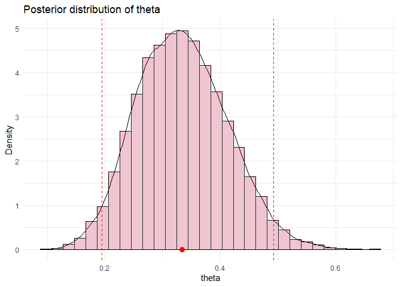

Board games attendance
================
Johannes Rajala
2024-02-25

In this document, I will use Bayesian statistics to estimate the
probability of me arriving at a board games meeting.

``` r
library(rstan)
library(ggplot2)
mc.cores <- parallel::detectCores()
options(mc.cores = mc.cores)
```

Let’s define the model. I will use a weakly informative prior, beta(1,
3), as I am more likely not to show up as opposed to show up, and a
Bernoulli likelihood.

``` stan
data {
  int<lower=0> N;
  array[N] int<lower=0, upper=1> y;
}

parameters {
  real<lower=0, upper=1> theta;
}

model {
  // weakly informative prior
  theta ~ beta(1, 3);
  // likelihood
  y ~ bernoulli(theta);
}
```

Let’s now draw some samples from the posterior distribution.

``` r
# stan data with 11 success and 21 fails
stan_data = list(N = 32, y = c(rep(1, 11), rep(0, 21)))

# sample
fit <- rstan::sampling(log_model, data = stan_data, chains = 4, iter = 10000)
```

Let us now determine if the chains have converged.

``` r
# Extract
theta <- extract(fit, permuted = FALSE, pars = "theta")
theta_combined <- extract(fit, pars = "theta")
# rhat
rhat = rstan::Rhat(theta[,,1])
cat("The Rhat for theta is", rhat, ", meaning that the chains have converged.\n")
```

    ## The Rhat for theta is 1.000273 , meaning that the chains have converged.

Let’s also print the posterior mean and 95 % credible interval.

``` r
# Get the posterior mean and 95 % credible interval
mean = mean(theta)
q = quantile(theta, c(0.025, 0.975))
cat("The posterior mean is", mean, "and the 95 % credible interval is", q[1], "to", q[2], ".\n")
```

    ## The posterior mean is 0.3341813 and the 95 % credible interval is 0.1943992 to 0.4922113 .

Lastly, let’s inspect the posterior distribution visually.

``` r
# Plot the posterior with mean and 95 % credible interval
ggplot(data.frame(theta = theta_combined), aes(x = theta)) +
  geom_histogram(aes(y = after_stat(density)), bins = 30, fill = "pink", color = "black") +
  geom_density(alpha = 0.2, fill = "lightblue") +
  labs(title = "Posterior distribution of theta", x = "theta", y = "Density") +
  geom_vline(xintercept = q[1], color = "red", linetype = "dashed") +
  geom_vline(xintercept = q[2], color = "red", linetype = "dashed") +
  geom_point(aes(x = mean, y = 0), color = "red", size = 3) +
  theme_minimal()
```

<!-- -->
