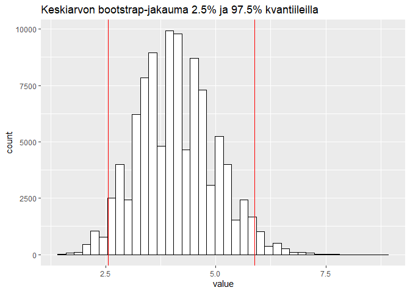

Bayesiläinen bootstrap
================
Johannes Rajala
2023-02-20

### Johdanto

Perinteinen bootstrap on uudelleenotantamenetelmä, jossa alkuperäisestä
$n$:n pituisesta otoksesta tehdään $n$:n pituinen uudelleenotanta
palauttamalla. Näin saatua uutta otosta kutsutaan bootstrap-otokseksi,
ja niitä käytetään usein estimoimaan alkuperäisestä datasta lasketun
estimaatin jakaumaa.

### Esimerkki

Lasketaan esimerkkidatan keskiarvon boostrap-jakauma.

``` r
data = c(1,2,4,4,5,8,2,2,9)

bootstrap = function(data, f, n){
  boot_results = c() # Vektori bootstrap tuloksia varten
  
  for(i in (1:n)){
    boot_results[i] = f(sample(data, length(data), replace = TRUE)) # Iteroidaan n kertaa ja lasketaan joka kerta funktion arvo bootstrap otokselle 
  }
  
  return(boot_results) # Palautetaan bootstrap otoksille lasketut funktion arvot 
}
```

``` r
results = as_tibble(bootstrap(data, {function(x) mean(x)}, 100000))
cat("Bootstrap-keskiarvojen varianssi:",var(results))
```

    ## Bootstrap-keskiarvojen varianssi: 0.7763187

<!-- -->

### Bootstrap painoilla

Bootstrapin voidaan ajatella toimivan myös niin, että jokaiselle
alkuperäisen otoksen havainnolle $y_i$ arvotaan kokonaislukupaino $w_i$
siten, että $\sum_{i=1}^n w_i = n$, tai vastaavasti
$\sum_{i=1}^n \frac{1}{n}w_i = 1$. Boootstrap otoksen $B^{(k)}$ painot
noudattavat siis multinomijakaumaa,
$W^{(k)} \sim \text{Multinomi}(1, n, (\frac{1}{n},\ldots,\frac{1}{n}))$.

### Bayesiläinen bootstrap

Painojen jakaumaksi voidaan valita disktreetin multinomijakauman sijaan
jatkuva Dirichlet-jakauma,
$\frac{1}{n}W^{(k)} \sim \text{Dirichlet}( 1, (1,\ldots,1))$, jolle
pätee $\sum_{i=1}^nw_i = 1$, ja vastaavasti $\sum_{i=1}^nnw_i = n$.
Dirichlet-jakaumaa voidaan käyttää epäinformatiivisena priorina
alkuperäiselle datalle tehdylle estimaatille, ja näin saadaan parametrin
estimaatin posteriorijakauma.

### Esimerkki

Tehdään sama esimerkki keskiarvolle kuin alussa, mutta bayselaisella
bootstrapilla.

``` r
data = c(1,2,4,4,5,8,2,2,9) # sama data kuin ensimmäisessä esimerkissä

bootstrap_bayes = function(data_, f, n = 10000, alpha = rep(1, length(data_))){
  boot_results = c() # Vektori bootstrap tuloskia varten
  len = length(data_) # datan pituus

  for(i in (1:n)){
    weights = rdirichlet(1, alpha)*len # lasketaan painot dirichlet jakaumasta
    boot_results[i] = f(data_*weights) # kerrotaan data painoilla
  }

  return(boot_results) # Palautetaan bootstrap otoksille lasketut funktion arvot 
}
```

``` r
results_bayes = as_tibble(bootstrap_bayes(data, {function(x) mean(x)}, 100000, alpha = rep(1, length(data))))
cat("Bayesiläisten bootstrap-keskiarvojen varianssi:",var(results_bayes))
```

    ## Bayesiläisten bootstrap-keskiarvojen varianssi: 0.7012525

<!-- -->

Saatu posteriorijakauma on paljon sileämpi kuin perinteinen keskiarvon
boostrap-jakauma ja varianssin estimaatti on pienempi.
