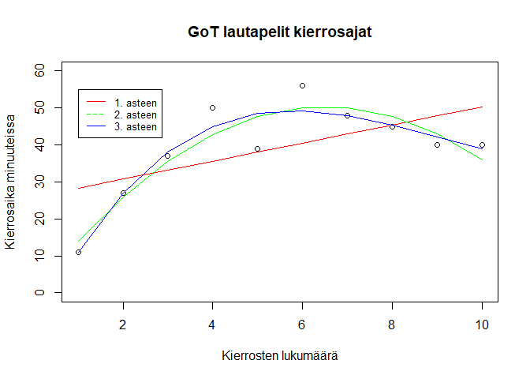
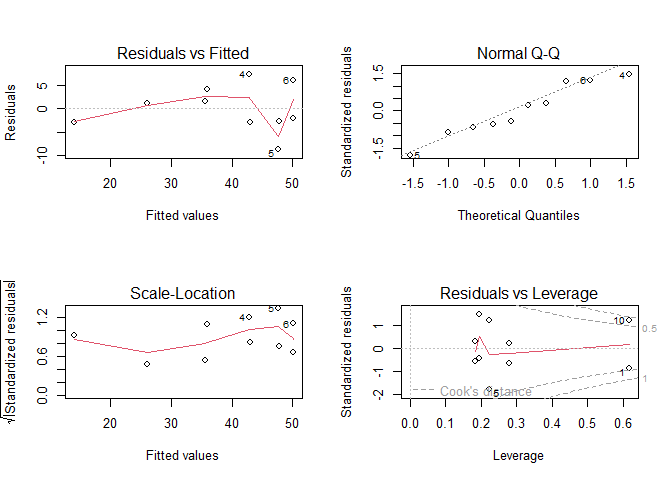

GoT lautapeli, kierrosajat
================
Johannes Rajala
2022-11-27

## Kierrosajat

Lasketaan ensin kierrosajat aloitusajoista.

``` r
i_rounds = c(1:10) # Kierrosten lukumäärä
t = c(13 + (30/60), 13+(41/60), 14+(8/60), 14+(45/60), 15+(35/60), 16+(14/60), 17+(10/60), 17+(58/60), 18+(43/60), 19+(23/60), 20+(3/60)) # Kierrosten alkuajat
t_diff = c() # Alustetaan tyhjä vektori kierrosaikoja varten

for(i in i_rounds){
  t_diff[i] = t[i+1]-t[i] # lasketaan kierrosajat
}
```

## Lineaariset mallit

Luodaan 1. 2. ja 3. asteen polynomisovitteet dataan.

``` r
model1 = lm(t_diff*60 ~  i_rounds )
model2 = lm(t_diff*60 ~  i_rounds + I(i_rounds^2))
model3 = lm(t_diff*60 ~  i_rounds + I(i_rounds^2) + I(i_rounds^3))
```

## Kuvaaja

Kuvataan kierroksen vaikutusta kierrosaikaan scatterplotilla ja siihen
sovitetuilla polynomeilla.

``` r
plot(i_rounds, ylim = c(0,60), 60*t_diff, main = "GoT lautapelit kierrosajat", ylab= "Kierrosaika minuuteissa", xlab = "Kierrosten lukumäärä")
x_seq = seq(1,10,length = 10)
lines(x_seq, predict(model1, data.frame(x=x_seq)), col='red')
lines(x_seq, predict(model2, data.frame(x=x_seq)), col='green')
lines(x_seq, predict(model3, data.frame(x=x_seq)), col='blue')

legend(1, 55, legend=c("1. asteen", "2. asteen", "3. asteen"),
       col=c("red", "green","blue"), lty=1:2, cex=0.8)
```

<!-- -->

## Mallinvalinta

Verrataan luotuja malleja varianssianalyysillä.

``` r
anova(model1, model2)
```

    ## Analysis of Variance Table
    ## 
    ## Model 1: t_diff * 60 ~ i_rounds
    ## Model 2: t_diff * 60 ~ i_rounds + I(i_rounds^2)
    ##   Res.Df    RSS Df Sum of Sq      F   Pr(>F)   
    ## 1      8 967.95                                
    ## 2      7 211.47  1    756.48 25.041 0.001558 **
    ## ---
    ## Signif. codes:  0 '***' 0.001 '**' 0.01 '*' 0.05 '.' 0.1 ' ' 1

``` r
anova(model1, model3)
```

    ## Analysis of Variance Table
    ## 
    ## Model 1: t_diff * 60 ~ i_rounds
    ## Model 2: t_diff * 60 ~ i_rounds + I(i_rounds^2) + I(i_rounds^3)
    ##   Res.Df    RSS Df Sum of Sq      F   Pr(>F)   
    ## 1      8 967.95                                
    ## 2      6 167.53  2    800.42 14.334 0.005184 **
    ## ---
    ## Signif. codes:  0 '***' 0.001 '**' 0.01 '*' 0.05 '.' 0.1 ' ' 1

Malli 1 on huonompi kuin malli 2 ja malli 3. Tutkitaan siis malleja 2 ja
3 vastakkain.

``` r
anova(model2, model3)
```

    ## Analysis of Variance Table
    ## 
    ## Model 1: t_diff * 60 ~ i_rounds + I(i_rounds^2)
    ## Model 2: t_diff * 60 ~ i_rounds + I(i_rounds^2) + I(i_rounds^3)
    ##   Res.Df    RSS Df Sum of Sq      F Pr(>F)
    ## 1      7 211.47                           
    ## 2      6 167.53  1    43.939 1.5737 0.2563

Malli 2 ei selitä dataa huonommin kuin malli 3. Jatketaan siis sillä.
Tarkastellaan seuraavaksi mallia 2.

``` r
summary(model2)
```

    ## 
    ## Call:
    ## lm(formula = t_diff * 60 ~ i_rounds + I(i_rounds^2))
    ## 
    ## Residuals:
    ##     Min      1Q  Median      3Q     Max 
    ## -8.6545 -2.9091 -0.5545  3.4076  7.1818 
    ## 
    ## Coefficients:
    ##               Estimate Std. Error t value Pr(>|t|)    
    ## (Intercept)    -0.4667     6.4645  -0.072 0.944471    
    ## i_rounds       15.6091     2.6999   5.781 0.000676 ***
    ## I(i_rounds^2)  -1.1970     0.2392  -5.004 0.001558 ** 
    ## ---
    ## Signif. codes:  0 '***' 0.001 '**' 0.01 '*' 0.05 '.' 0.1 ' ' 1
    ## 
    ## Residual standard error: 5.496 on 7 degrees of freedom
    ## Multiple R-squared:  0.8552, Adjusted R-squared:  0.8138 
    ## F-statistic: 20.67 on 2 and 7 DF,  p-value: 0.001156

Kierroksen lineaarinen vaikutus kasvattaa kierrosaikaa 15.6 minuutilla
per kierros, mutta kierroksen neliöllinen vaikutus pienentää
kierrosaikaa 1.2 per kierros.

``` r
par(mfrow = c(2,2))
plot(model2)
```

<!-- -->

Mallin diagnostiikka vaikuttaa hyvältä näin pienelle otannalle.
