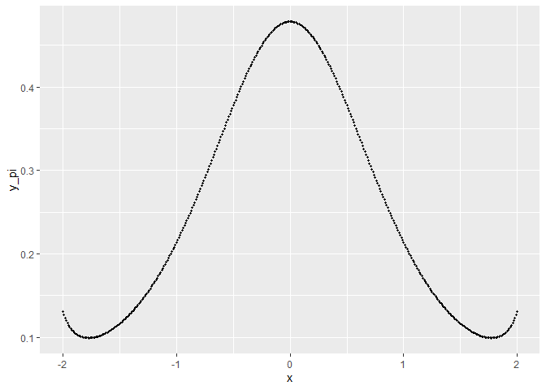
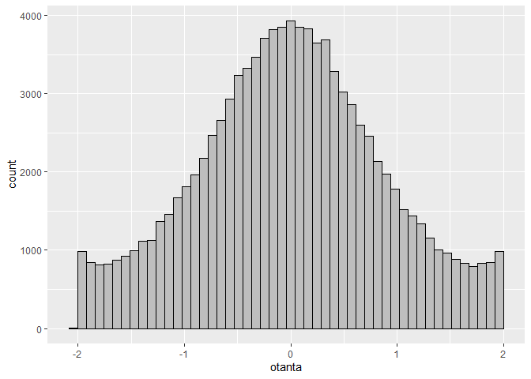

Hylkäysotanta
================
Johannes Rajala
2023-01-28

#### Teoriaa

Hylkäysotanta on yksi menetelmä, jolla voidaan tuottaa satunnaislukuja
analyyttisesti monimutkaiseta tiheysfuntiosta $\pi_X$ (kohdejakauma),
jonka integraalifuntkiota ei osata tai voida esittää alkeisfunktioiden
avulla. Hylkäysotannassa käytetään hyväksi ehdotusjakaumaa $g_{X'}$,
josta osataan generoida satunnaislukuja.

Olkoon $c$ reaaliluku, jolle

$$
\pi_X(x) \leq cg_{X'}(x)
$$

kaikilla $x\in X$.

**Hylkäysotanta algoritmi:**

1.  generoi $X' \sim g_{X'},$
2.  generoi $Y \sim \text{Tas}(0, cg_{X'}(X'))$,
3.  jos $Y>\pi_X(X')$, hylkää $X'$ ja toista riviltä 1,
4.  palauta $X'$.

Tällä tavoin generoidut pisteet $X'$ noudattavat jakaumaa $\pi_X$.

#### Toteutus RStudiossa

``` r
rejection_general = function(n, pi, g, g_simulate, find_C = TRUE, a=0, b=0, c=1){
  
  # n := kohdejakaumasta generoitavien pisteiden lukumäärä
  # pi := kohdejakauman tiheysfunktio
  # g := ehdotusjakauman tiheysfunktio
  # g_simulate := funktio, joka tuottaa satunnaisluvun ehdotusjakaumasta g
  # find_C := Etsiikö funtio vakiokertoimen c, jolla c*g(x) > f(x), kaikilla x in [a,b]
  # a, b := Väli, jolla vakiokerrointa c etsitään
  # c := Jos vakiokerroin c annetaan (ja find_C = FALSE), ei tarvita väliä [a,b], ja suoritusaika lyhenee.
  
  samples = c() # Alustetaan vektori satunnaislukuja varten
  
  # Jos skalaarikerrointa ei annettu, etsitöön se (vaatii välin [a,b])
  if(find_C == TRUE){
    ratio = function(x){pi(x)/g(x)} # Tiheysfunktioiden suhde, 
    #tämä on kohdefunktio seuraavassta maksimointitehtävässä
    c = optimize(ratio, interval = c(a,b), maximum = TRUE)[["objective"]] 
    # Vakiokerroin, jolla c*g(x)>f(x), kaikilla x in [a,b]
  }
  
  # Generoidaan satunnaislukuja kunnes niitä on n kappaletta
  while(length(samples)<n){
      x = g_simulate() # Generoidaan piste ehdotusjakaumasta g
      y = runif(1,0,c*g(x)) # Generoidaan 1 tasajakautunut piste väliltä 
      #[0, c*g(x)] (eli nollasta skaalattuun ehdotusjakaumaan pisteessä x)
      if( pi(x) > y ){ # Jos generoitu piste y on kohdejakauman pi alla,
        # hyväksytään generoitu piste x
        samples = append(samples, x)
      }
  }
  
  return(samples) # Näin generoidut pisteet noudattavat jakaumaa pi
}
```

#### Esimerkki

Olkoon kohdejakauma
$\pi_X(x) = \frac{1}{2.09157} \sqrt{\frac{e^{-x^2}}{\sin{x^2}+1}}$, kun
$x \in [-2,2]$, ja muuten $\pi_X(x)=0$, josta halutaan tuottaa
realisaatioita väliltä $[-2,2]$ ja ehdotusjakauma
$g_{X'}(x) = \frac{1}{4}$, kun $x \in [-2,2]$, ja muuten $g_{X'}(x)=0$,
eli ehdotusjakaumana toimii tasajakauma.

Kirjoitetaan tavittavat funktiot, ja plotataan miltä $\pi_X(x)$ näyttää.

``` r
pi = function(x){
  if(-2<=x && x<=2){
    return(1/2.09157 * sqrt( (exp(-x^2) / (1+sin(x^2)))))
  }
  else{
    return(0)
  }
}

g = function(x){
  if(-2<=x && x<=2){
    return(1/4)
  }
  else{
    return(0)
  }
  
}

g_simulate_ = {function() runif(1,-2,2)}
```

``` r
x = seq(-2,2, 0.01)
y_pi = pi(x)
data = data.frame(x, y_pi)
```

``` r
ggplot(data = data, aes(x=x, y=y_pi))+
  geom_point(size = 0.7)
```

<!-- -->

Tuotetaan nyt hylkäysotannalla 100 000 satunnaislukua jakaumasta
$\pi_X$.

``` r
n = 100000
otanta = rejection_general(n, pi, g, g_simulate_, find_C = TRUE, a=-2, b=2)
```

``` r
ggplot(data = data.frame(otanta), aes(x=otanta))+
  geom_histogram(color="black", fill="grey", bins=50)
```

<!-- -->

Otanta näyttää onnistuneen.
