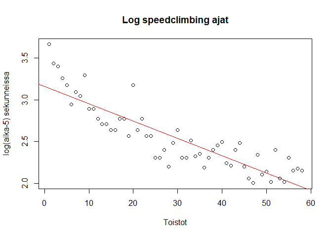

Speedclimb aika
================
Johannes Rajala
2022-11-28

## Johdanto

Harjoitustyön aiheena on mallintaa erään henkilön nopeuskiipeilyaikoja.

## Datan tarkastelua

``` r
y = speed$V1
x = c(1:length(y))
```

``` r
plot(x,y, xlab = "Toistot", ylab = "Aika sekunneissa", main = "Speedclimbing ajat")
```

<!-- -->

## Lineaarinen malli

$y=ae^{bx}+5$ vaikuttaa sopivalta mallilta, sillä 5 sekuntia on
maailmanennätysaikojen taso, eli se sopii asymptootiksi. Eli
$y-5 = ae^{bx}$, josta saadaan lineaarinen malli ottamalla logaritmit
molemmin puolin: $\log(y-5) = bx + log(a)$.

``` r
y_new = log(y-5)
plot(x,y_new, xlab = "Toistot", ylab = "log(aika-5) sekunneissa", main = "Log speedclimbing ajat")
abline(lm(y_new ~ x), col = "red")
```

<!-- -->

## Korkeamman asteen lineaariset mallit

Suora ei vaikuta riittävältä, sillä residuaalit näyttävät riippuvan
toistoista. Kokeillaan korkeamman asteen polynomeja.

``` r
model1 = lm(y_new ~ x)
model2 = lm(y_new ~ x + I(x^2))
model3 = lm(y_new ~ x + I(x^2) + I(x^3))
```

``` r
plot(x, y_new, main = "Polynomisovitteet log ajalle", ylab= "Aika", xlab = "Toistot")
x_seq = seq(1,length(x),length = length(x))
lines(x_seq, predict(model1, data.frame(x=x_seq)), col='red')
lines(x_seq, predict(model2, data.frame(x=x_seq)), col='green')
lines(x_seq, predict(model3, data.frame(x=x_seq)), col='blue')

legend(1, 2.5, legend=c("1. asteen", "2. asteen", "3. asteen"),
       col=c("red", "green","blue"), lty=1:2, cex=0.8)
```

<!-- -->

## Mallinvalinta

``` r
anova(model1, model2)
```

    ## Analysis of Variance Table
    ## 
    ## Model 1: y_new ~ x
    ## Model 2: y_new ~ x + I(x^2)
    ##   Res.Df    RSS Df Sum of Sq     F    Pr(>F)    
    ## 1     56 2.1520                                 
    ## 2     55 1.3858  1   0.76623 30.41 9.652e-07 ***
    ## ---
    ## Signif. codes:  0 '***' 0.001 '**' 0.01 '*' 0.05 '.' 0.1 ' ' 1

``` r
anova(model1, model3)
```

    ## Analysis of Variance Table
    ## 
    ## Model 1: y_new ~ x
    ## Model 2: y_new ~ x + I(x^2) + I(x^3)
    ##   Res.Df    RSS Df Sum of Sq     F    Pr(>F)    
    ## 1     56 2.1520                                 
    ## 2     54 1.2872  2   0.86481 18.14 9.412e-07 ***
    ## ---
    ## Signif. codes:  0 '***' 0.001 '**' 0.01 '*' 0.05 '.' 0.1 ' ' 1

``` r
anova(model2, model3)
```

    ## Analysis of Variance Table
    ## 
    ## Model 1: y_new ~ x + I(x^2)
    ## Model 2: y_new ~ x + I(x^2) + I(x^3)
    ##   Res.Df    RSS Df Sum of Sq      F  Pr(>F)  
    ## 1     55 1.3858                              
    ## 2     54 1.2872  1  0.098584 4.1357 0.04691 *
    ## ---
    ## Signif. codes:  0 '***' 0.001 '**' 0.01 '*' 0.05 '.' 0.1 ' ' 1

Edetään siis mallilla 3, eli $\log(y-5) = a+b_1x+b_2x^2+b_3x^3$.

## Sovitteet alkuperäiseen kuvaajaan

Luodaan funktiot, jotka laskevat sovitteiden arvot kaikille kolmelle
mallille alkuperäiseen dataan.

``` r
modexp1 = function(a,b,x){
  return(exp(a)*exp(b*x))
}

a = model1[["coefficients"]][["(Intercept)"]]
b = model1[["coefficients"]][["x"]]
y_hat_1 = c()

for(i in c(1:length(x))){
  y_hat_1[i] = modexp1(a,b,i)
}
```

``` r
modexp2 = function(a,b1,b2,x){
  return(exp(a)*exp(b1*x+b2*x^2))
}

a = model2[["coefficients"]][["(Intercept)"]]
b1 = model2[["coefficients"]][["x"]]
b2 = model2[["coefficients"]][["I(x^2)"]]

y_hat_2 = c()
for(i in c(1:length(x))){
  y_hat_2[i] = modexp2(a,b1,b2,i)
}
```

``` r
modexp3 = function(a,b1,b2,b3,x){
  return(exp(a)*exp(b1*x+b2*x^2+b3*x^3))
}

a = model3[["coefficients"]][["(Intercept)"]]
b1 = model3[["coefficients"]][["x"]]
b2 = model3[["coefficients"]][["I(x^2)"]]
b3 = model3[["coefficients"]][["I(x^3)"]]

y_hat_3 = c()
for(i in c(1:length(x))){
  y_hat_3[i] = modexp3(a,b1,b2,b3,i)
}
```

## Plotit

``` r
plot(x,y, xlab = "Toistot", ylab = "Aika sekunteina", main = "Speedclimb sovitteet")
lines(x,(y_hat_3)+5, col = "blue")
lines(x,(y_hat_2)+5, col = "green")
lines(x,(y_hat_1)+5, col = "red")
legend(46, 43, legend=c("1. asteen", "2. asteen", "3. asteen"),
       col=c("red", "green","blue"), lty=1:2, cex=0.8)
```

<!-- -->

Ja parhaan mallin plottaus vielä yksinään.

``` r
plot(x,y, ylim = c(0,46), xlab = "Toistot", ylab = "Aika sekunteina", main = "Speedclimb, paras sovite")
lines(x,(y_hat_3)+5, col = "blue")
```

<!-- -->

``` r
summary(model3)
```

    ## 
    ## Call:
    ## lm(formula = y_new ~ x + I(x^2) + I(x^3))
    ## 
    ## Residuals:
    ##      Min       1Q   Median       3Q      Max 
    ## -0.24571 -0.09763 -0.03063  0.07868  0.56381 
    ## 
    ## Coefficients:
    ##               Estimate Std. Error t value Pr(>|t|)    
    ## (Intercept)  3.554e+00  8.663e-02  41.019  < 2e-16 ***
    ## x           -7.149e-02  1.261e-02  -5.670 5.73e-07 ***
    ## I(x^2)       1.450e-03  4.943e-04   2.934   0.0049 ** 
    ## I(x^3)      -1.120e-05  5.510e-06  -2.034   0.0469 *  
    ## ---
    ## Signif. codes:  0 '***' 0.001 '**' 0.01 '*' 0.05 '.' 0.1 ' ' 1
    ## 
    ## Residual standard error: 0.1544 on 54 degrees of freedom
    ## Multiple R-squared:  0.8601, Adjusted R-squared:  0.8523 
    ## F-statistic: 110.6 on 3 and 54 DF,  p-value: < 2.2e-16

``` r
par(mfrow =c(2,2))
plot(model3)
```

<!-- -->

Piste 20 on oudokki, mutta en poista sitä koska se ei ole kovin
vaikutusvaltainen. Muuten diagnostiikka ok.
